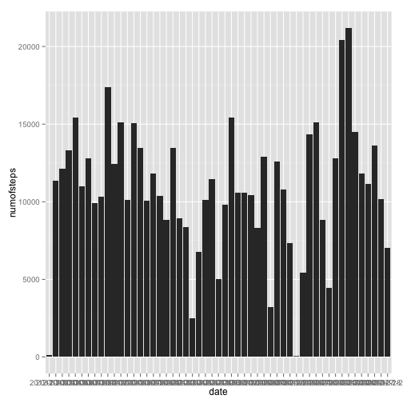
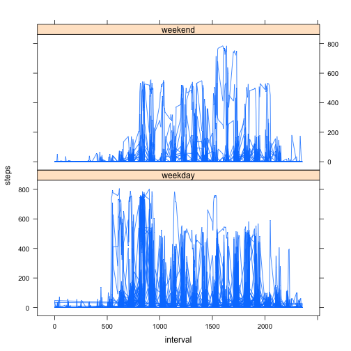

Reproducible Research Peer Assignment 1
========================================================
### Loading Library

```r
library("ggplot2")
library("sqldf")
```

```
## Loading required package: gsubfn
## Loading required package: proto
## Could not load tcltk.  Will use slower R code instead.
## Loading required package: RSQLite
## Loading required package: DBI
## Loading required package: RSQLite.extfuns
```

```r
library("lattice")
library("knitr")
Sys.setlocale("LC_TIME", "en_US")
```
### Loading and preprocessing the data


```r
dataraw<-read.csv("activity.csv")
```

### Question 1: What is mean total number of steps taken per day?


```r
avgstep<-sqldf("select date, sum(steps) as numofsteps from dataraw group by date having numofsteps is not null", )
```


```r
qplot(date, numofsteps, data=avgstep, geom="bar", stat="identity")
```

 


```r
mean(avgstep$numofsteps)
```

```
## [1] 10766
```

```r
median(avgstep$numofsteps)
```

```
## [1] 10765
```

### Question 2: What is the average daily activity pattern?

```r
avgint<-sqldf("select interval, avg(steps) as avgsteps from dataraw where steps is not null group by interval")
plot(avgint$interval, avgint$avgsteps, type="l")
```

 

```r
longestint<-avgint[avgint$avgsteps==max(avgint$avgsteps),]
longestint$interval
```

```
## [1] 835
```

### Question 3: Inputing missing values

```r
nadata<-dataraw[is.na(dataraw$steps),]
```

Total Num of Rows with NA

```r
nrow(nadata)
```

```
## [1] 2304
```
Fill in

```r
datafill<-dataraw
datafill$steps[is.na(datafill$steps)]<-mean(avgint$avgsteps)
```
Hist

```r
avgstep2<-sqldf("select date, sum(steps) as numofsteps from datafill group by date having numofsteps is not null", )
qplot(date, numofsteps, data=avgstep2, geom="bar", stat="identity")
```

 

```r
mean(avgstep2$numofsteps)
```

```
## [1] 10766
```

```r
median(avgstep2$numofsteps)
```

```
## [1] 10766
```
- The mean of the new data is the same as the data in the first part.
- The median of the new data is different from the data in the first part.

### Question 4: Are there differences in activity patterns between weekdays and weekends?


```r
dataraw$date <- strptime(dataraw$date, "%Y-%m-%d")
dataweek<-cbind(dataraw, weekday=as.POSIXlt(dataraw$date)$wday)
dataweek[dataweek$weekday %in% 1:5,4] <- "weekday"
dataweek[dataweek$weekday ==0 ,4] <- "weekend"
dataweek[dataweek$weekday ==6 ,4] <- "weekend"
xyplot(steps~interval|weekday, data=dataweek,layout=c(1,2),type="l")
```

 
