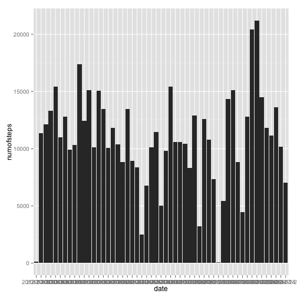
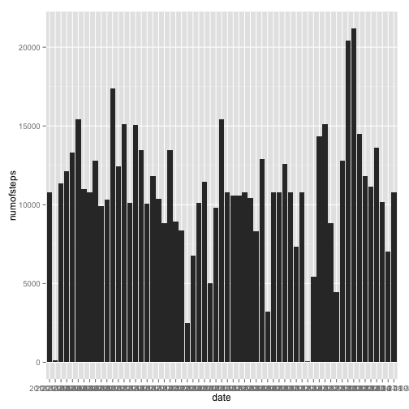
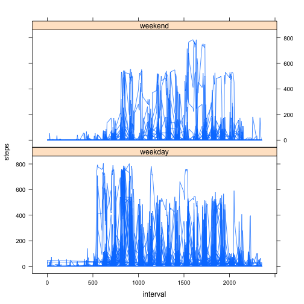

Reproducible Research Peer Assignment 1
========================================================

## Loading and pre-processing the data


```r
        dataraw<-read.csv("activity.csv")
        library("ggplot2")
        library("sqldf")
```

```
## Loading required package: gsubfn
## Loading required package: proto
## Could not load tcltk.  Will use slower R code instead.
## Loading required package: RSQLite
## Loading required package: DBI
## Loading required package: RSQLite.extfuns
```

```r
        library("lattice")
        library("knitr")
        Sys.setlocale("LC_TIME", "en_US")
```

## What is mean total number of steps taken per day?


```r
        daystep<-sqldf("select date, sum(steps) as numofsteps from dataraw 
                       group by date having numofsteps is not null", )
        qplot(date, numofsteps, data=daystep, geom="bar", stat="identity")
```

 

### The mean total number of steps taken per day is:

```r
        mean(daystep$numofsteps)
```

```
## [1] 10766
```

### The median total number of steps taken per day is:

```r
        median(daystep$numofsteps)
```

```
## [1] 10765
```

## What is the average daily activity pattern?
###     1. a time series plot

```r
        avgint<-sqldf("select interval, avg(steps) as avgsteps from dataraw 
                      where steps is not null group by interval")
        plot(avgint$interval, avgint$avgsteps, type="l")
```

 

###     2. Which 5-minute interval, on average across all the days in the dataset, contains the maximum number of steps?


```r
        longestint<-avgint[avgint$avgsteps==max(avgint$avgsteps),]
        longestint$interval
```

```
## [1] 835
```

## Inputing missing values
###     1. Calculate and report the total number of missing values in the dataset

```r
        nadata<-dataraw[is.na(dataraw$steps),]
```

###     Total Num of Rows with NA is:

```r
        nrow(nadata)
```

```
## [1] 2304
```


###     2.Filling in all of the missing values in the dataset, 
###        with the average of the 5-min  interval.

Create a new dataset called datafill

```r
        datafill<-merge(dataraw,avgint,by="interval",all=F)
        datafill$steps[is.na(datafill$steps)]<-
                datafill$avgsteps[is.na(datafill$steps)]
        datafill<-datafill[,-4]
```

Make a histogram of the total number of steps taken each day

```r
        avgstep2<-sqldf("select date, sum(steps) as numofsteps from datafill 
                        group by date having numofsteps is not null", )
        qplot(date, numofsteps, data=avgstep2, geom="bar", stat="identity")
```

 

The mean total number of steps taken per day is:

```r
        mean(avgstep2$numofsteps)
```

```
## [1] 10766
```

The median total number of steps taken per day is:

```r
mean(avgstep2$numofsteps)
```

```
## [1] 10766
```

### Thus, we know that:
        - The mean of the data without NAs is the same as the data with NAs.
        - The median of the data without NAs is different from the data with NAs.

## Are there differences in activity patterns between weekdays and weekends?


```r
        dataraw$date <- strptime(dataraw$date, "%Y-%m-%d")
        dataweek<-cbind(dataraw, weekday=as.POSIXlt(dataraw$date)$wday)
        dataweek[dataweek$weekday %in% 1:5,4] <- "weekday"
        dataweek[dataweek$weekday ==0 ,4] <- "weekend"
        dataweek[dataweek$weekday ==6 ,4] <- "weekend"
        xyplot(steps~interval|weekday, data=dataweek,layout=c(1,2),type="l")
```

 
